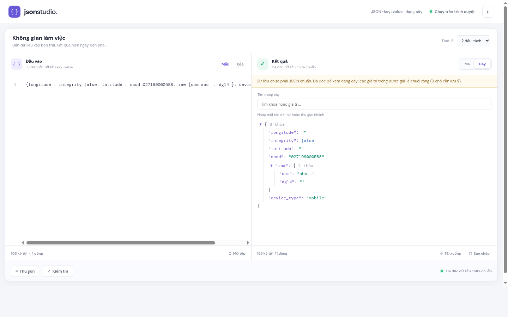

# JSON Studio

Dán JSON chuẩn hoặc dữ liệu dạng `key=value` để xem kết quả tức thì. Mọi thao tác chạy trong trình duyệt; nội dung không được gửi lên máy chủ.

## Chức năng

- **Đọc dữ liệu chưa chuẩn:** Hỗ trợ khóa không có dấu nháy, dấu `=`, giá trị trống và đối tượng lồng nhau. Các giá trị trống thành chuỗi rỗng; mã có số 0 đầu được giữ nguyên.
- **Xem dạng cây:** Tự mở khi dữ liệu chưa chuẩn; có thể tìm, mở và thu gọn nhánh.
- **Định dạng tự động:** Dán là có kết quả ngay; khi gõ, kết quả cập nhật sau một khoảng dừng ngắn.
- **Tiện ích:** Thu gọn JSON, đổi mức thụt lề, mở tệp, sao chép và tải kết quả.

## Chạy thử

Mở `index.html` trực tiếp, hoặc chạy `python3 -m http.server 8000` rồi truy cập `http://localhost:8000`.

Trang là HTML, CSS và JavaScript tĩnh, không cần cài thư viện hay build trước khi đưa lên Cloudflare Pages.

Chạy kiểm tra bộ phân tích: `node --test tests/parser.test.js`.
